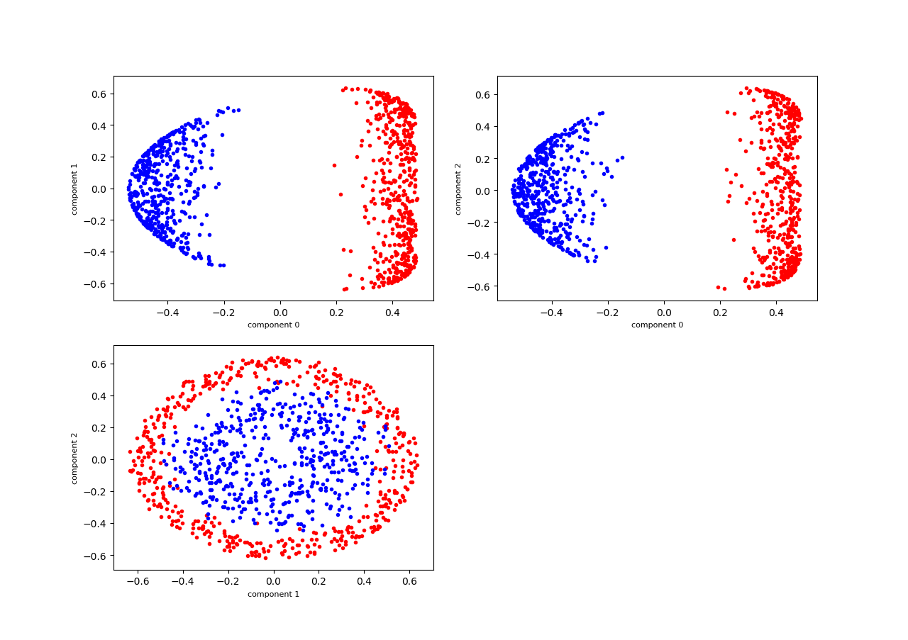

# Dalys - library for visualising data analysis algorithms

Dalys - library that allows to visualize many algorithms that need for statistical data processing and machine learning

## Getting Started

Dalys is a wrapper over the library [scikit-learn](scikit-learn.org/) and you can use [scikit-learn datasets](http://scikit-learn.org/stable/datasets/index.html) for visualize desired algorithm.

Example:

```python
from sklearn.datasets import make_circles
from dalys.kernel_pca import KPCATool


X, y = make_circles(n_samples=1000, random_state=123, noise=0.1, factor=0.2)

style = [('red', '.'), ('blue', '.')]
label_names = ['red dotes', 'blue dotes']

kpca = KPCATool(X, y, style=style, labels_unique_name=label_names, n_components=3,
                kernel='rbf', gamma=2, scaled=True)
kpca.projections_plot(grid=22)
```
Example of gridplot with *grid*=22:



There is a number of parameters that can be set for the KPCATool class;
the major ones are as follows:

* *style* - set marker styles and colors for data representation, 
example: style = [('red', '.'), ('blue', '.')] or
style = [('red', 'd'), ('blue', 'd')]. If you need random colors and markers - leave this argument with default parameter (default = None).

* *labels_unique_name* - set list with class names, such as labels_unique_name = ['red dotes', 'blue dotes']. If *labels_unique_name* is *None*,
this means that labels will be numbered in ascending order (default = None).

* *preprocessing* - for use data preprocessing, set this parameter to one of the following options (default = 'std'):
    * **std** - [standardize features](https://scikit-learn.org/stable/modules/generated/sklearn.preprocessing.StandardScaler.html)
    * **norm_l1** - [L1 normalization](https://scikit-learn.org/stable/modules/generated/sklearn.preprocessing.normalize.html)
    * **norm_l2** - [L2 normalization](https://scikit-learn.org/stable/modules/generated/sklearn.preprocessing.normalize.html)
    * **minmax** - [MinMax scaler](https://scikit-learn.org/stable/modules/generated/sklearn.preprocessing.MinMaxScaler.html)
    * **maxabs** - [MaxAbs scaler](https://scikit-learn.org/stable/modules/generated/sklearn.preprocessing.MaxAbsScaler.html)
    

* *scaled* - this flag need to control preprocessing of your data, if your data is allready processed, you must set "True".

### Installing
pip install dalys

## Authors

* **Timothy Tkachenko** - Machine Learning Researcher
